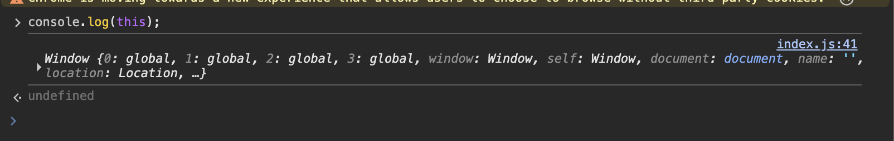
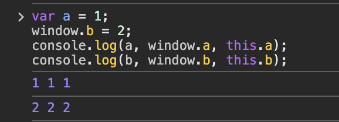
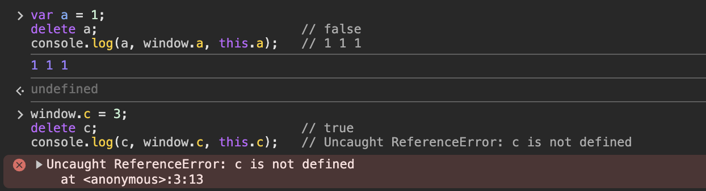
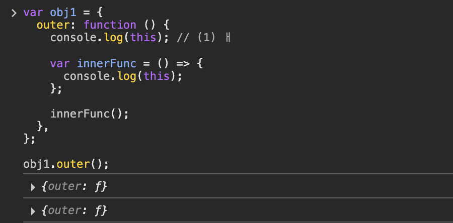
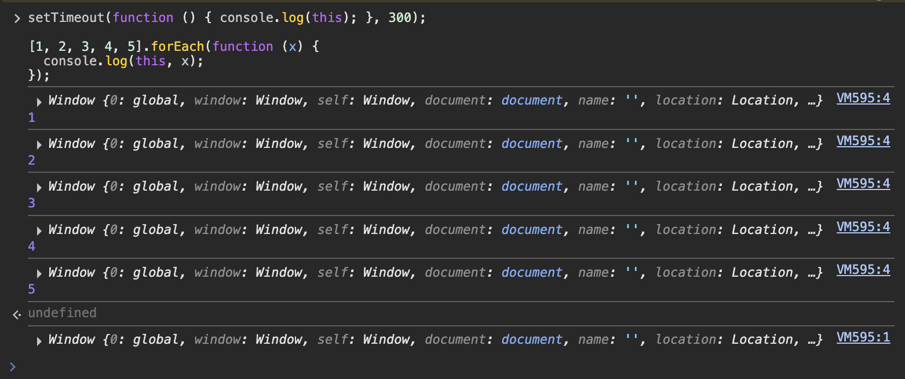

# this

다른 대부분의 객체지향 언어에서 this는 클래스로 생성한 인스턴스 객체이다.<br />
그러나 자바스크립트에서 this는 어디서든 사용할 수 있다.

함수와 객체의 구분이 느슨한 자바스크립트에서 this는<br />
실질적으로 이 둘을 구분하는 거의 유일한 기능이다.

<br />
<br />

# 1. 상황에 따라 달라지는 this

자바스크립트에서 this는 기본적으로<br />
실행 컨텍스트(eval, 전역공간, 함수)가 생성될 때 함께 결정된다.<br />
`===` this는 함수를 호출할 때 결정된다.

함수를 어떤 방식으로 호출하느냐에 따라 값이 달라지는데<br />
상황별 this가 어떤 값이 되는 지 살펴보자!

<br />

## 1) 전역 공간에서의 this

전역 공간에서는 전역 컨텍스트를 생성하는 주체가<br />
전역 객체(브라우저:window, Node.js:global)이기 때문에<br />
this는 이 전역 객체를 가리킨다.<br />

(전역 객체는 자바스크립트 런타임 환경에 따라<br />
window, Node.js 등 다른 이름을 가짐)



<br />

### 전역 변수와 전역 객체

자바스크립트의 모든 변수는 실은 특정 객체의 프로퍼티로 동작하는데,<br />
전역 변수를 선언하면 자바스크립트 엔진은 이를 전역 객체의 프로퍼티로 할당한다.



예를 들어, 전역 공간에서 선언한 변수 a에 1을 할당하고,<br />
window(전역객체)의 프로퍼티 b를 2에 할당하면,<br />

> a, window.a와 this.a 모두 1이 출력되고, b, window.b, this.b 모두 2가 출력된다.

<br />

### a 기준으로, 왜 모두 1이 나올까?

a를 기준으로 살펴보면 변수 a에 접근하고자 하면 스코프 체인에서 a를 검색하다가<br />
가장 마지막에 도달하는 전역 스코프의 L.E(전역 객체)에서<br />
해당 프로퍼티 a를 발견해 그 값을 반환하기 때문이다.

전역 공간에서는 var로 변수를 선언하는 대신 window의 프로퍼티에 직접 할당하더라도<br />
결과적으로 var로 선언한 것과 대부분 똑같이 동작한다.

<br />

### 다만 삭제 명령에서는 다르다!



그러나, '삭제' 명령에 대해서는 전역 변수 선언과 전역 객체의 프로퍼티 할당이 다르게 동작한다.

처음부터 전역객체의 프로퍼티로 할당한 경우에는 삭제가 되는데,<br />
전역 변수로 선언한 경우에는 삭제가 안된다.

> 사용자가 의도치 않게 삭제하는 것을 방지하는 차원에서 마련한 방어 전략으로 해석할 수 있다.

<br />
<br />

## 2) 메서드로서 호출할 때 그 메서드 내부에서의 this

### 함수 🆚 메서드

일반적으로 어떤 함수를 실행하는 방법은 두 가지다.<br />
(함수로서 호출하는 경우, 메서드로서 호출하는 경우)

<br />

### '함수로서의 호출'과 '메서드로서의 호출'?

이 둘을 구분하는 유일한 차이는 독립성인데,<br />
함수는 그 자체로 **독립적인 기능을 수행**하는 반면,<br />
메서드는 자신을 **호출한 대상 객체에 관한 동작을 수행**한다.

어떤 함수를 객체의 프로퍼티에 할당한다고 해서<br />
그 자체로서 무조건 메서드가 되는 것이 아니라,<br />
객체의 메서드로서 호출할 경우에만 메서드로 동작하고, 그렇지 않으면 함수로 동작한다.

<br />

### '함수로서의 호출'과 '메서드로서의 호출'을 구분하는 법?

함수 앞에 점(.)과 대괄호의 유무로 알 수 있는데,<br />
점이 없으면 함수로서 호출이고, 점이 있으면 메서드로서 호출이다.<br />
(대괄호의 경우도 동일)

```js
var func = function (x) {
  console.log(this, x);
};

func(1); // Window { ... } 1

var obj = {
  method: func,
};

obj.method(2); // { method: f } 2
obj["method"](3); // { method: f } 3
```

<br />

### 메서드 내부에서의 this?

메서드로서 호출하는 경우, **호출 주체는 바로 함수명(프로퍼티명) 앞의 객체**이다.<br />
(점 표기법의 경우 마지막 점 앞에 명시된 객체가 곧 this되는 것)

<br />
<br />

## 3) 함수로서 호출할 때 그 함수 내부에서의 this

### 함수 내부에서의 this

어떤 함수를 함수로서 호출할 경우에는 this가 지정되지 않는다.

this는 지정되지 않는 경우 전역 객체를 바라보므로,<br />
함수에서의 this는 전역 객체를 가리킨다.

<br />

### 메서드의 내부 함수에서의 this

함수로서 호출했는지 메서드로서 호출했는지만 파악하면 this의 값을 정확히 맞출 수 있다.

#### 내부함수에서의 this

```js
var obj1 = {
  outer: function () {
    console.log(this); // (1)

    var innerFunc = function () {
      console.log(this); // (2) (3)
    };

    innerFunc();

    var obj2 = {
      innerMethod: innerFunc,
    };

    obj2.innerMethod();
  },
};

obj1.outer();
```

#### 🧐 어떤 결과가 나올까?

각 console.log 위치에서 this가 가리키는 건

```
(1) : {outer: ƒ} // obj1
(2) : Window { ... } // 전역 객체(Window)
(3) : {innerMethod: ƒ} // obj2이다.
```

> 즉, this 바인딩에 관해서는 함수를 실행하는<br />
> 당시의 주변 환경(메서드 내부인지, 함수 내부인지 등)은 중요하지 않고,<br />
> 오직 해당 함수를 호출하는 구문 앞에 점 또는 대괄호 표기가 있는지 없는지가 관건이다.

<br />

### 메서드의 내부 함수에서의 this를 우회하는 방법

ES5 까지는 자체적으로 내부함수에 this를 상속할 방법이 없지만,<br />
변수를 활용하면 우회할 수 있다.

상위 스코프의 this를 변수로 저장해 내부함수에서 활용하려는 수단으로 사용한다.

<br />

### this를 바인딩하지 않는 함수

ES6에서는 this를 바인딩하지 않는 화살표 함수를 새로 도입했다.

화살표 함수는 실행 컨텍스트를 생성할 때 this 바인딩 과정 자체가 빠지게 되어,<br />
상위 스코프의 this를 그대로 활용할 수 있다.

#### this를 바인딩하지 않는 함수(화살표 함수)

```js
var obj1 = {
  outer: function () {
    console.log(this);

    var innerFunc = () => {
      console.log(this);
    };

    innerFunc();
  },
};

obj1.outer();
```



<br />
<br />

## 4) 콜백 함수 호출 시 그 함수 내부에서의 this

함수 A의 제어권을 다른 함수(또는 메서드) B에게 넘겨주는 경우 함수 A를 콜백 함수라고 한다.

함수 A는 함수 B의 내부 로직에 따라 실행되며,<br />
this 역시 함수 B 내부 로직에서 정한 규칙에 따라 값이 결정된다.

#### 콜백 함수 내부에서의 this

```js
setTimeout(function () {
  console.log(this);
}, 300);

[1, 2, 3, 4, 5].forEach(function (x) {
  console.log(this, x);
});

document.body.innerHTML += '<button id="a">클릭</button>';
document.body.querySelector("#a").addEventListener("click", function (e) {
  console.log(this, e);
});
```



#### 콜백함수를 일반 함수 / 화살표 함수로 실행해보자!

https://codepen.io/myhfmuii-the-vuer/pen/LYKREZa

해당 코드에서는 addEventListener는 버튼을 클릭하면<br />
앞서 지정한 엘리먼트와 클릭 이벤트에 관한 정보가 담긴 객체가 출력된다.

<br />
<br />

## 5) 생성자 함수 내부에서의 this

생성자 함수는 어떤 공통된 성질을 지니는 객체들을 생성하는 데 사용하는 함수이다.

객체지향 언어에서는 생성자를 클래스,<br />
클래스를 통해 만든 객체를 인스턴스라 한다. (붕어빵틀이 클래스라면 붕어빵이 인스턴스)

생성자는 구체적인 인스턴스를 만들기 위한 일종의 틀이고,<br />
new 명령어와 함께 함수를 호출하면 해당 함수가 생성자로서 동작하게 된다.

```js
var Cat = function (name, age) {
  this.bark = "야옹";
  this.name = name;
  this.age = age;
};

var choco = new Cat("초코", 7);
var nabi = new Cat("나비", 5);

console.log(choco, nabi);
```

#### 결과

```
// choco
Cat {bark: '야옹', name: '초코', age: 7}
// nabi
Cat {bark: '야옹', name: '나비', age: 5}
```

어떤 함수가 생성자 함수로서 호출된 경우 내부에서의 this는<br />
곧 새로 만들 구체적인 인스턴스 자신이 된다.

<br />

## 6) 요약

- 전역공간에서의 this는 전역객체(브라우저에서는 window, Node.js에서는 global)를 참조한다.
- 어떤 함수를 메서드로서 호출한 경우 this는 메서드 호출 주체(메서드명 앞의 객체)를 참조한다.
- 어떤 함수를 함수로서 호출한 경우 this는 전역객체를 참조한다. (메서드의 내부함수에서도 같음)
- 콜백 함수 내부에서 this는 해당 콜백 함수의 제어권을 넘겨받은 함수가 정의한 바에 따르며, 정의하지 않은 경우에는 전역객체를 참조한다.
- 생성자 함수에서의 this는 생성될 인스턴스를 참조한다.

<br />
<br />

# 2. 명시적으로 this를 바인딩하는 방법

## 1) call 메서드

```js
Function.prototype.call(thisArg[, arg1[, arg2[, ...]]])
```

- 메서드의 호출 주체인 함수를 즉시 실행하도록 하는 명령이다.
- 첫 번째 인자를 this로 바인딩하고, 이후의 인자들을 호출할 함수의 매개변수로 한다.
- 함수를 그냥 실행하면 this는 전역 객체를 참조하지만 call 메서드를 이용하면 임의의 객체를 this로 지정할 수 있다.

```js
var func = function (a, b, c) {
  console.log(this, a, b, c);
};

func(1, 2, 3); // Window{ ... } 1 2 3
func.call({ x: 1 }, 4, 5, 6); // { x:1 } 4 5 6

var obj = {
  a: 1,
  method: function (x, y) {
    console.log(this.a, x, y);
  },
};

obj.method(2, 3); // 1 2 3
obj.method.call({ a: 4 }, 5, 6); // 4 5 6
```

<br />
<br />

## 2) apply 메서드

```js
Function.prototype.apply(thisArg[, argsArray])
```

call 메서드와 기능적으로 완전 동일하나,<br />
두 번째 인자를 **배열로 받아 그 배열의 요소들을 호출할 함수의 매개 변수로 지정**한다.

```js
var func = function (a, b, c) {
  console.log(this, a, b, c);
};

func.apply({ x: 1 }, 4, 5, 6); // { x:1 } 4 5 6

var obj = {
  a: 1,
  method: function (x, y) {
    console.log(this.a, x, y);
  },
};

obj.method.apply({ a: 4 }, 5, 6); // 4 5 6
```

<br />
<br />

## 3) call / apply 메서드의 활용

유사배열객체 (array-like object)에 배열 메서드를 적용할 수 있다.

1. 유사배열객체에 배열 메서드를 적용
2. arguments.NodeList에 배열 메서드를 적용
3. 문자열에 배열 메서드를 적용
4. ES6의 Array.from 메서드 적용

```js
var obj = {
  0: "a",
  1: "b",
  2: "c",
  length: 3,
};

// 유사배열객체에 배열 메서드 적용
Array.prototype.push.call(obj, "d");
console.log(obj); // { 0: 'a', 1: 'b', 2: 'c', 3: 'd', length: 4 }

var arr = Array.prototype.slice.call(obj);
console.log(arr); // ['a', 'b', 'c', 'd']

// ES6의 Array.from
var arr = Array.from(obj);
console.log(arr); // ['a','b','c']
```

<br />

### 생성자 내부에서 다른 생성자를 호출

생성자 내부에 다른 생성자와 공통된 내용이 있을 경우<br />
call 또는 apply를 이용해 다른 생성자를 호출하면 간단하게 반복을 줄일 수 있다.

```js
function Person(name, gender) {
  this.name = name;
  this.gender = gender;
}

function Student(name, gender, school) {
  Person.call(this, name, gender);
  this.school = school;
}

function Employee(name, gender, company) {
  Person.apply(this, [name, gender]);
  this.company = company;
}

var chu = new Student("슬기", "female", "피플대");
var people = new Employee("피플", "male", "피플앤테크놀로지");
```

> Student, Employee 생성자 함수 내부에서 Person 생성자 함수를 호출해서<br />
> 인스턴스의 속성을 정의하도록 구현했다.

<br />

### 여러 인수를 묶어 하나의 배열로 전달하고 싶을 때 - apply 활용

#### 최솟값, 최대값을 구하는 코드

```js
// 여러 인수를 받는 메서드(Math.max/Math.min)에 apply 적용
var numbers = [10, 20, 3, 16, 45];
var max = Math.max.apply(null, numbers);
var min = Math.min.apply(null, numbers);
console.log(max, min); // 45 3

// ES6의 스프레드 연산자 활용
const numbers = [10, 20, 3, 16, 45];
const max = Math.max(...numbers);
const min = Math.min(...numbers);

console.log(max, min); // 45 3
```

> call / apply 메서드는 명시적으로 별도의 this를 바인딩하면서<br />
> 함수 또는 메서드를 실행하는 훌륭한 방법이지만<br /> <br />
> 오히려 이로 인해 this를 예측하기 어렵게 만들어 코드 해석을 방해한다는 단점이 있으나,<br />
> ES5 이하의 환경에서는 마땅한 대안이 없기 때문에 실무에서 매우 광범위하게 활용되고 있다.

<br />
<br />

## 3) bind 메서드

```js
Function.prototype.bind(thisArg[, arg1[, arg2[, ...]]])
```

call과 비슷하지만 즉시 호출하지는 않고 넘겨받은 this 및 인수들을 바탕으로<br />
새로운 함수를 반환하기만 하는 메서드이다.

```js
var func = function (a, b, c, d) {
  console.log(this, a, b, c, d);
};
func(1, 2, 3, 4); // Window{ ... } 1 2 3 4

var bindFunc1 = func.bind({ x: 1 });
bindFunc1(5, 6, 7, 8); // { x:1 } 5 6 7 8

var bindFunc2 = func.bind({ x: 1 }, 4, 5);
bindFunc2(6, 7); // { x:1 } 4 5 6 7
bindFunc2(8, 9); // { x:1 } 4 5 8 9
```

bind메서드를 적용해서 새로 만든 함수는 name 프로퍼티에<br />
동사 bind의 수동태인 'bound'라는 접두어가 붙는다.

어떤 함수의 name 프로퍼티가 'bound xxx' 라면<br />
이는 곧 함수명이 xxx인 원본 함수에 bind 메서드를 적용한 새로운 함수라는 의미로<br />
기존의 call이나 apply 보다 코드를 추적하기에 더 수월하다.

> 콜백 함수 내에서의 this에 관여하는 함수 또는 메서드에 대해서<br />
> bind 메서드를 이용하면 this 값 커스텀이 가능하다.

<br />
<br />

## 4) 화살표 함수의 예외사항

ES6에 새롭게 도입된 화살표 함수는 실행 컨텍스트 생성 시<br />
this를 바인딩하는 과정이 제외됐다.

화살표 함수 내부에는 this가 아예 없으며,<br />
접근하고자 하면 스코프 체인상 가장 가까운 this에 접근하게 된다.

화살표 함수를 사용하면 별도의 변수로 this를 우회하거나<br />
call/apply/bind를 적용할 필요가 없어 더욱 간결하고 편리하다.

<br />
<br />

## 5) 별도의 인자로 this를 받는 경우(콜백 함수 내에서의 this)

콜백 함수를 인자로 받는 메서드 중 일부는<br />
추가로 this로 지정할 객체(thisArg)를 인자로 지정할 수 있는 경우가 있다.

이러한 메서드의 thisArg 값을 지정하면<br />
콜백 함수 내부에서 this 값을 원하는 대로 변경할 수 있다.<br />

(이런 형태는 여러 내부 요소에 대해 같은 동작을 반복 수행해야 하는<br />
배열 메서드와 Set, Map 등의 메서드에도 일부 존재한다.)

<br />

### 콜백 함수와 함께 thisArg를 인자로 받는 메서드

```
Array.prototype.forEach(callback[, thisArg])
Array.prototype.map(callback[, thisArg])
Array.prototype.filter(callback[, thisArg])
Array.prototype.some(callback[, thisArg])
Array.prototype.every(callback[, thisArg])
Array.prototype.find(callback[, thisArg])
Array.prototype.findIndex(callback[, thisArg])
Array.prototype.flatMap(callback[, thisArg])
Array.prototype.from(arrayLike[, callback[, thisArg])
Set.prototype.forEach(callback[, thisArg])
Map.prototype.forEach(callback[, thisArg])
```

<br />
<br />

## 6) 요약

- call, apply 메서드는 this를 명시적으로 지정하면서 함수 또는 메서드를 호출한다.
- bind 메서드는 this 및 함수에 넘길 인수를 일부 지정해서 새로운 함수를 만든다.
- 요소를 순회하면서 콜백 함수를 반복 호출하는 내용의 일부 메서드는 별도의 인자를 this로 받는다.
