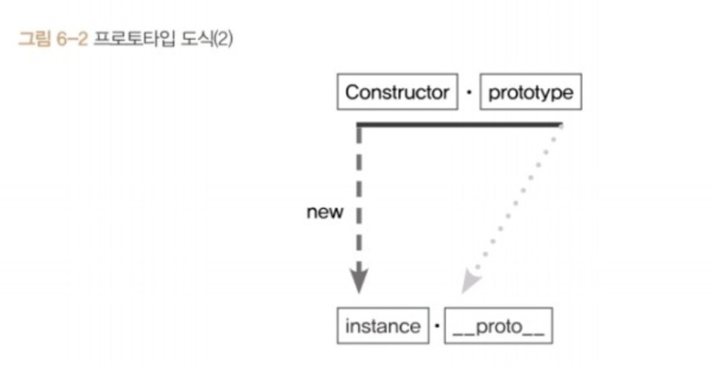
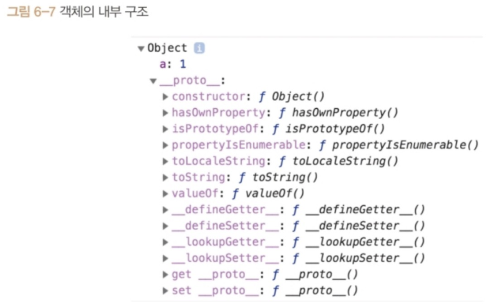
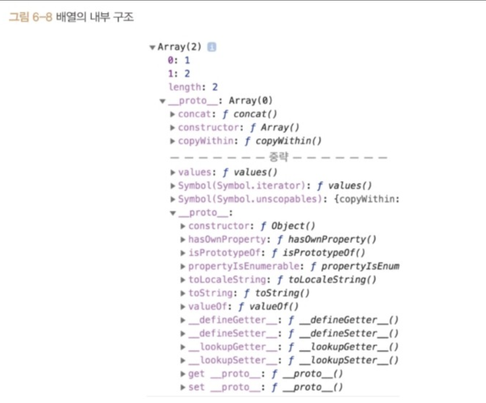
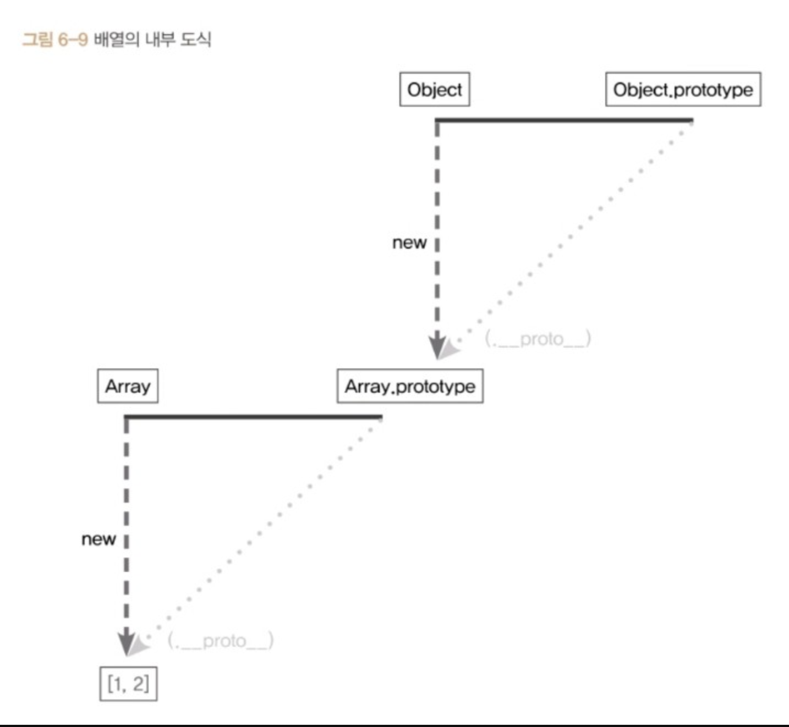
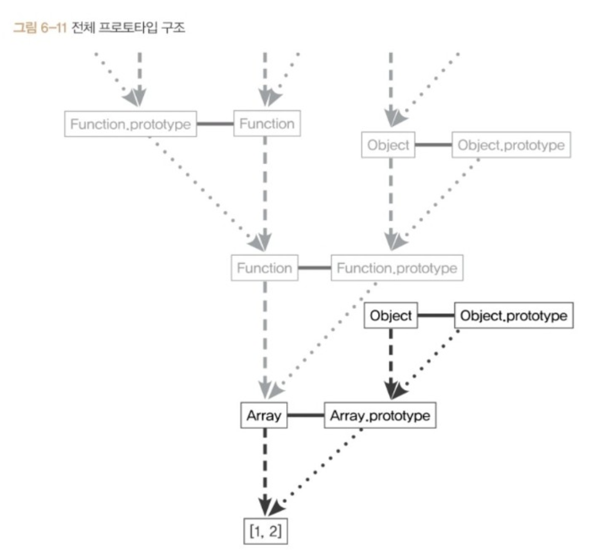
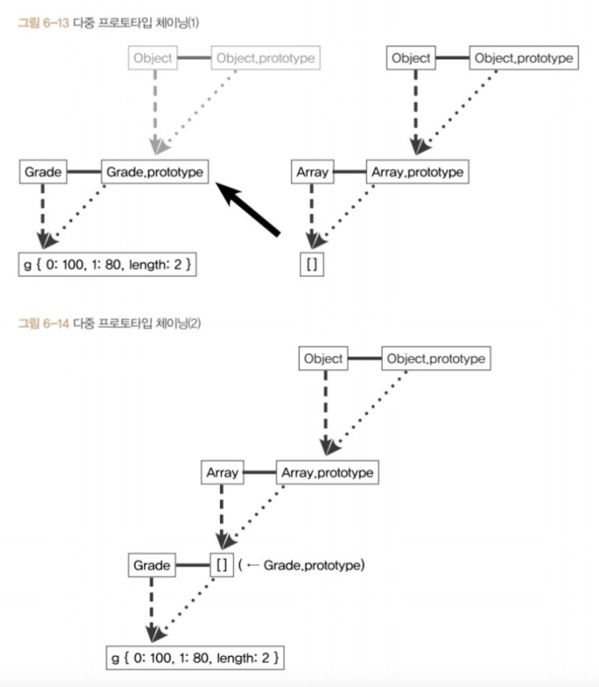

# 6. 프로토 타입

자바스크립트는 프로토타입 기반의 언어이다.

프로토타입 기반 언어에서는 어떠한 객체를 원형으로 삼고<br />
이를 복제함으로써 클래스 기반 언어의 상속과 비슷한 효과를 얻는다.

<br />
<br />

# 1) 프로토타입의 개념 이해

## (1) constructor, prototype, instance



> 출처: 정재남 "코어 자바스크립트, 위키북스"

```js
var instance = new Constructor();
```

- 윗변의 왼쪽 꼭짓점에는 Constructor(생성자 함수)를, 오른쪽 꼭짓점에는 Constructor.prototype이라는 프로퍼티를 위치되어 있다.
- 아래에는 Constructor로부터 아래방향으로 new와 화살표가 있고 그 화살표의 끝에는 instance가 있다.
- 또한 윗변의 오른쪽 꼭짓점(Constructor.prototype)으로부터 대각선 아래 방향으로 화살표가 있으며 이것은 `instance.__proto__`를 가리키고 있는것을 확인할 수 있다.

<br />

### 이 구조가 뜻하는 과정을 알아보자

1. 어떤 생성자 함수를 new 연산자와 함께 호출
2. Constructor에서 정의된 내용을 바탕으로 새로운 인스턴스 생성
3. 이때 instance에는 `__proto__` 라는 프로퍼티가 자동으로 부여
4. 이 프로퍼티는 Constructor.prototype을 참조

prototype이라는 프로퍼티와 `__proto__`라는 프로퍼티의 관계가 프로토 타입 개념의 핵심인데,<br />
prototype은 객체이며 이것을 참조한 `__proto__`역시 객체이다.

prototype 객체 내부에는 인스턴스가 사용할 메서드를 저장하면<br />
인스턴스에서도 숨겨진 프로퍼티인 `__proto__`를 통해 이 메서드들에 접근할 수 있다.

<br />

### 다음의 코드를 통해 확인해보자

```js
var Person = function (name) {
  this._name = name;
};

Person.prototype.getName = function () {
  return this._name;
};
```

Person의 prototype에 getName이라는 메서드를 생성했다.<br />
그럼 Person으로 생성된 인스턴스는 `__proto__` 프로퍼티를 사용해 getName을 호출할 수 있다.

<br />

### 왜 undefined가 나올까?

```js
var seulgi = new Person("seulgi");
seulgi.__proto__.getName(); // undefined
```

> instance의 `__proto__`가 Constructor의 prototype 프로퍼티를 참조하므로 둘은 같은 객체를 바라보기 때문이다.

- 여기서 getName의 호출결과가 undefined인 점에 주목하기보다는 "에러가 발생하지 않았다"는 점이 더 중요하다.
- getName의 호출결과가 undfined가 나온 것은 해당 변수가 (여기서는 getName이) "호출할 수 있는 함수"에 해당한다는 것을 의미한다.
- 이로써 우리는 getName을 `__proto__`를 사용하여 접근할 수 있다는 것을 확인할 수 있다.

<br />

### 왜 기대한 name이 정상적으로 호출되지 않은걸까?

함수를 '메서드로서' 호출할 때는 메서드 바로 앞의 객체가 this이다.<br />
여기에서는 seulgi가 this가 아니고 `seulgi.__proto__`라는 객체가 this가 된 것이다.<br />

이 객체의 내부에는 name이라는 프로퍼티가 없으므로<br />
찾고자 하는 식별자가 정의되어 있지 않아 undefined를 반환한 것이다.

만약 `seulgi.__proto__`라는 객체에 name이라는 프로퍼티가 있다면
다음과 같이 잘 출력되는 것을 확인할 수 있다.

```js
var seulgi = new Person("seulgi");
seulgi.__proto__ = "seulgi__proto__";
seulgi.__proto__.getName(); // "seulgi__proto__"
```

> 결국 this를 어떻게 설정하느냐에 따라서 결과가 달라지는 것이다.

<br />

### `__proto__` 없이 인스턴스에서 곧바로 메서드를 쓴다면?

```js
var seulgi = new Person("seulgi");
seulgi.getName(); // seulgi

var pnt = new Person("pnt");
pnt.getName(); // "pnt"
```

- this를 인스턴스에 잘 바인딩할 수 있고, `__proto__`를 빼고 메서드를 호출했는데 이게 잘 작동되고 심지어 원하는 값도 나온다.

> 이러한 이유는 바로 `__proto__`가 **생략 가능**한 프로퍼티이기 때문이다.
> 원래부터 생략이 가능하도록 정의되어 있기 때문에, 이것은 이해의 영역이 아니므로 '그냥 그런가보다'하고 넘어가자.

new 연산자로 Constructor를 호출하면 instance가 만들어지는데,<br />
이 instance의 생략 가능한 프로퍼티인 `__proto__`는 Constructor의 prototype을 참조한다.

<br />

### 프로토타입의 개념을 좀 더 상세하게 설명해보자

자바스크립트는 함수에 자동으로 객체인 prototype 프로퍼티를 생성해 놓는데<br />
해당 함수를 생성자 함수로서 호출할 경우에는 이 생성자 함수로 생성된 새로운 인스턴스에<br />
숨겨진 프로퍼티인 `__proto__`가 자동으로 생성되며 이 프로퍼티는 생성자 함수의 prototype 프로퍼티를 참조한다.

`__proto__`는 생략 가능하도록 구현돼 있기 때문에 생성자 함수의 prototype에 어떤 메서드나 프로퍼티가 있다면 <br />
인스턴스에서도 마치 자신의 것처럼 prototype의 메서드나 프로퍼티에 접근할 수 있다.

```js
var Constructor = function (name) {
  this.name = name;
};
Constructor.prototype.method1 = function () {};
Constructor.prototype.property1 = "Constructor Prototype Property";

var instance = new Constructor("Instance");
console.dir(Constructor);
console.dir(instance);
```

> 생성자 함수의 이름을 표기함으로써 해당 생성자 함수의 인스턴스임을 표기하는 것으로<br /> > `__proto__`를 열어보면 method1, property1등 Constructor의<br />
> prototype과 동일한 내용으로 구성돼 있음을 확인할 수 있다.

<br />
<br />

## (2) Constructor 프로퍼티

생성자 함수의 프로퍼티인 prototype 객체 내부에는 Constructor라는 프로퍼티가 있다.<br />
이 프로퍼티는 단어 그대로 원래의 생성자 함수(자기 자신)을 참조한다.

이 프로퍼티를 통해 인스턴스로부터 그 원형이 무엇인지를 알 수 있다.

```js
var arr = [1, 2];
Array.prototype.constructor === Array; // true
arr.__proto__.constructor === Array; // true
arr.constructor === Array; // true

var arr2 = new arr.constructor(3, 4);
console.log(arr2); // [3, 4]
```

인스턴스의 `__proto__`가 생성자 함수의 prototype 프로퍼티를 참조하며<br />
`__proto__`가 생략 가능하기 때문에 인스턴스에서 직접 constructor에 접근할 수 있는 수단이 생긴 것이다.

그래서 6번째 줄의 명령도 오류없이 동작하게 된다.

<br />

### constructor 프로퍼티는 읽기 전용 속성이 부여된 경우를 제외하면 값을 바꿀 수 있다.

```js
var NewConstructor = function () {
  console.log("this is new constructor!");
};

var dataTypes = [
  1, // Number & false
  "test", // String & false
  true, // Boolean & false
  {}, // NewConstructor & false
  [], // NewConstructor & false
  function () {}, // NewConstructor & false
  /test/, // NewConstructor & false
  new Number(), // NewConstructor & false
  new String(), // NewConstructor & false
  new Boolean(), // NewConstructor & false
  new Object(), // NewConstructor & false
  new Array(), // NewConstructor & false
  new Function(), // NewConstructor & false
  new RegExp(), // NewConstructor & false
  new Date(), // NewConstructor & false
  new Error(), // NewConstructor & false
];

dataTypes.forEach(function (d) {
  d.constructor = NewConstructor;
  console.log(d.constructor.name, "&", d instanceof NewConstructor);
});
```

- 모든 데이터가 d instance of NewConstructor 명령에 대해 false를 반환한다.
- 이로부터 constructor를 변경해도 참조하는 대상이 변경될 뿐 이미 만들어진 인스턴스의 원형이 바뀐다거나 데이터 타입이 변하는 것은 아님을 알 수 있다.
- 어떤 인스턴스의 생성자 정보를 알아내기 위해 constructor 프로퍼티에 의존하는 게 항상 안전하지는 않은 것이다.

> 비록 어떤 인스턴스로부터 생성자 정보를 알아내는 유일한 수단인 constructor가<br />
> 항상 안전하지는 않지만 오히려 그렇기 때문에 클래스의 상속을 흉내 내는 것이 가능해진 측면도 있다.

<br />

### 정리 차원에서 다음 예제를 확인해보자.

```js
var Person = function (name) {
  this.name = name;
};

var p1 = new Person("사람1"); // Person { name: "사람1" } true
var p1Proto = Object.getPrototypeOf(p1);
var p2 = new Person.prototype.constructor("사람2"); // Person { name: "사람2" } true
var p3 = new p1Proto.constructor("사람3"); // Person { name: "사람3" } true
var p4 = new p1.__proto__.constructor("사람4"); // Person { name: "사람4" } true
var p5 = new p1.constructor("사람5"); // Person { name: "사람5" } true

[p1, p2, p3, p4, p5].forEach(function (p) {
  console.log(p, p instanceof Person);
});
```

p1부터 p5까지는 모두 Person의 인스턴스이다. 따라서 다음의 두 공식이 성립한다.

1. 다음 각 줄은 모두 동일한 대상을 가리킨다

```js
[Constructor][instance].__proto__.constructor[instance].constructor;
Object.getPropertyOf([instance]).constructor[Constructor].prototype.constructor;
```

2. 다음 각 줄은 모두 동일한 객체에 접근할 수 있다.

```js
[Constructor].prototype[instance].__proto__[instance];
Object.getPrototypeOf([instance]);
```

<br />
<br />

# 2) 프로토타입 체인

## (1) 메서드 오버라이드

prototpe 객체를 참조하는 `__proto__`를 생략하면 인스턴스는<br />
prototype에 정의된 프로퍼티나 메서드를 마치 자신의 것처럼 사용할 수 있다고 했다.

<br />

### 만약 인스턴스가 동일한 이름의 프로퍼티 또는 메서드를 가지고 있다면 어떻게 될까?

```js
var Person = function (name) {
  this.name = name;
};
Person.prototype.getName = function () {
  return this.name;
};

var iu = new Person("지금");
iu.getName = function () {
  return "바로 " + this.name;
};
console.log(iu.getName()); // 바로 지금
```

`iu.__proto__.getName`이 아니라 iu객체에 있는 getName이 호출되었다.<br />
여기서 일어난 현상이 **메서드 오버라이드**로, 메서드 위에 메서드를 덮어 씌웠다는 표현이다.

자바스크립트 엔진이 getName이라는 메서드를 찾는 방식은 가장 가까운 대상인 자신의 프로퍼티를 검색하고,<br />
없으면 그다음으로 가까운 대상인 `__proto__`를 검색하는 순서로 진행된다.

<br />

### 메서드 오버라이딩이 이뤄진 상황에서 prototype에 있는 메서드에 접근하려면 어떻게 하면 될까?

```js
console.log(iu.__proto__.getName());
```

`iu.__proto__.getName()`을 호출했더니 undefined가 출력됐다.

this가 `iu.__proto__`을 가리키는데 prototype 상에는 name 프로퍼티가 없기 때문이다.<br />
만약 prototype에 name이 있다면 그 값을 출력할 것이다.

```js
Person.prototype.name = "이지금";

console.log(iu.__proto__.getName()); // 이지금
```

원하는대로 호출이 되지만 this가 prototype을 바라보고 있다.<br />
이걸 인스턴스를 바라보도록 바꿔주기 위해 call이나 apply를 사용해보자.

```js
console.log(iu.__proto__getName.call(iu)); // 지금
```

> 일반적으로 메서드가 오버라이드된 경우에는 자신으로부터 가장 가까운 메서드에만 접근할 수 있지만, <br />
> 그다음 가까운 `__proto__`의 메서드도 우회적인 방법을 통해서이지만 접근이 불가능한 것은 아니다.

<br />
<br />

## (2) 프로토타입 체인

프로토타입 체인에 앞서 객체의 내부 구조를 확인해보자.

```js
console.dir({ a: 1 });
```



> 출처: 정재남 "코어 자바스크립트, 위키북스"

이번에는 배열의 내부 구조를 학인해보자.



> 출처: 정재남 "코어 자바스크립트, 위키북스"

배열 리터럴의 `__proto__`에는 pop, push 등의 익숙한 배열 메서드 및 constructor가 있다. 그리고 이 `__proto__`안에는 또다시 `__proto__`가 있는데 이것은 그림 6-7의 `__proto__`와 동일한 것을 확인할 수 있다.

그 이유는 prototype 객체가 '객체'이기 때문이다. 기본적으로 모든 객체의 `__proto__`에는 Object.prototype이 연결된다. prototype 객체도 예외가 이니며, 이것을 그림으로 표현하면 다음과 같다.



> 출처: 정재남 "코어 자바스크립트, 위키북스"

`__proto__`는 생략이 가능하다. 그렇기 때문에 Array.prototype 내부의 메서드를 마치 자신의 것처럼 실행할 수 있다. 마찬가지로 Object.prototype 내부의 메서드도 자신의 것처럼 실행할 수 있다. 생략 가능한 `__proto__`를 한 번 더 따라가면 Object.prototype을 참조할 수 있기 때문이다.

```js
var arr = [1, 2];
arr.push(3);
arr.hasOwnProperty(2); // true
```

어떤 데이터의 `__proto__` 프로퍼티 내부에서 다시 `__proto__` 가 연쇄적으로 이어진 것을 프로토타입 체인이라 하고 이 체인을 따라가며 검색하는 것을 프로토타입 체이닝이라고 한다.

<br />

### 프로토타입 체이닝은 메서드 오버라이드와 동일한 맥락!

어떤 메서드를 호출하면 자바스크립트 엔진은 데이터 자신의 프로퍼티를 검색하여 원하는 메서드가 있으면<br />
그 메서드를 실행하고, 없으면 `__proto__`를 검색하여 있을때까지 실행하는 식으로 진행된다.

```js
var arr = [1, 2];
Array.prototype.toString.call(arr); // 1,2
Object.prototype.toString.call(arr); // [object Array]
arr.toString(); // 1,2

arr.toString = function () {
  return this.join("_");
};
arr.toString(); // 1_2
```

arr 변수는 배열이므로 `arr.__proto__`는 Array.prototype을 참조하고<br />
`Array.prototype.__proto__`는 Object.prototype을 참조할 것이다.

<br />

### 배열뿐만아니라 자바스크립트 데이터는 모두 프로토타입 체인 구조를 가진다

앞서 소개한 도식의 삼각형들은 오직 instance를 중심으로 `__proto__`를 따라가는 루트만 표기했는데, 접근 가능한 모든 경우를 표기하면 다음 그림처럼 매우 복잡해진다.



> 출처: 정재남 "코어 자바스크립트, 위키북스"

각 생성자 함수는 모두 함수이기 때문에 Function 생성자 함수의 prototype과 연결된다.

Function 생성자 함수 역시 함수이므로 다시 Function 생성자 함수의 prototype과 연결된다.<br />
이런식으로 `__proto__`의 constructor의 `__proto__`의 constructor를<br />
재귀적으로 반복하는 루트를 따르면 끝없이 찾아갈 수 있다.

이미 생성자 함수를 알고 있는 이상, 어떤 인스턴스가 해당 생성자 함수의 인스턴스인지<br />
여부를 알아야 하는 경우가 아니라면 그냥 생성자 함수를 사용하면 되기 때문에<br />
굳이 인스턴스를 통해 접근해야 할 필요는 없을 것이다.

우리는 일반적으로 인스턴스와 "직접적인 연관"이 있는 삼각형에만 주목하면 된다.

<br />
<br />

## (3) 다중 프로토타입 체인

프로토타입 체인은 사용자가 새롭게 만들어서 단계를 확장시키는 것이 가능하다.<br />
대각선의 `__proto__`를 연결해 나가기만 하면 무한대로 체인 관계를 이어나갈 수 있다.

```js
var Grade = function () {
  var args = Array.prototype.slice.call(arguments);

  for (var i = 0; i < args.length; i++) {
    this[i] = args[i];
  }

  this.length = args.length;
};

var g = new Grade(100, 80);
```

변수 g는 Grade로 생성된 인스턴스이다.

Grade의 인스턴스는 여러개의 인자를 받아 각 순서대로 인덱싱해서 저장하고<br />
length 프로퍼티가 존재하는 등 배열의 형태를 지니지만,<br />
배열의 메서드는 사용할 수 없는 유사배열객체이다.

call, apply를 사용하여 배열의 메서드를 적용할 수 있지만<br />
g.**proto**가 즉, Grande.prototype이 배열의 인스턴스를 바라보게하면 그것이 가능하다.

```js
Grade.prototype = [];
```

위 코드를 사용하여 Grade의 prototype이 배열을 바라보도록 하였다.<br />
이 명령에 의해 그림과 같이 하나의 프로토타입이 체인 형태를 띄게 된다.



> 출처: 정재남 "코어 자바스크립트, 위키북스"

<br />

### 이제는 Grade의 인스턴스인 g에서 직접 배열의 메서드를 사용할 수 있다.

```js
console.log(g); // Grade(2) [100, 80]
g.pop();
console.log(g); // Grade(2) [100]
g.push(90);
console.log(g); // Grade(2) [100, 90]
```

> g 인스턴스는 이제 프로토타입 체인을 따라 자신이 지니는 멤버뿐만 아니라 생성자 함수인 Grade의 prototype에 있는 멤버, Array.prototype에 있는 멤버, 최종으로 Object.prototype에 있는 멤버까지 접근 가능하며 이 멤버들을 사용할 수 있다.

<br />
<br />

## 3) 정리

- 어떤 생성자 함수를 new 연산자와 함께 호출하면 Constructor에서 정의된 내용을 바탕으로 새로운 인스턴스가 생성된다.
- 이 인스턴스에는 `__proto__`라는, constructor의 prototype 프로퍼티를 참조하는 프로퍼티가 자동으로 부여된다.
- `__proto__`는 생략 가능한 속성으로 인스턴스는 Constructor.prototype의 메서드를 자신의 메서드처럼 호출 할 수 있다.
- Constructor.prototype의 constructor 프로퍼티는 생성자 함수 자신을 가리킨다.
- 직각삼각형의 대각선 방향으로 계속 찾아가면 최종적으로 Object.prototype에 당도한다.
- 이런식으로 `__proto__`를 찾아가는 과정이 프로토타입 체이닝이며 이 체이닝을 통해 상위 프로토타입의 메서드를 자신의 것처럼 호출할 수 있다.
- Object.prototype에는 모든 데이터 타입에서 사용할 수 있는 범용적인 메서드만 존재하며 객체 전용 메서드는 Object 생성자 함수에 스태틱하게 담겨있다.

<br />
<br />
