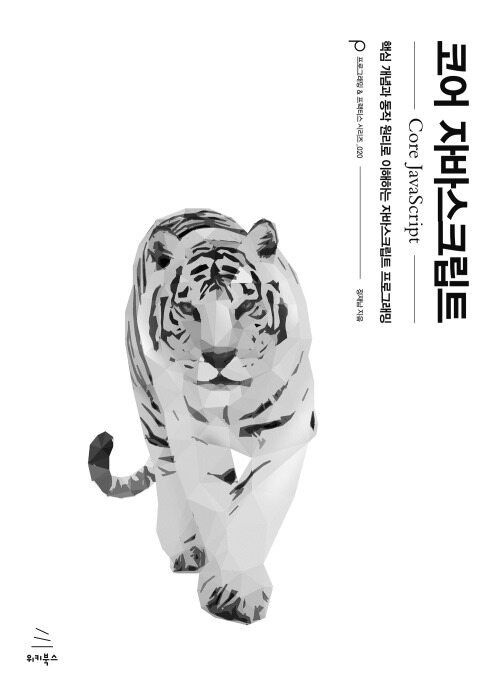

# 📚 코어 자바스크립트 북 스터디

 

# 🧐 주차 별 학습 내용

| 주차 | 대주제        | 소주제                                                  | 학습일자(YY-MM-DD) | assignee |
| ---- | ------------- | ------------------------------------------------------- | ------------------ | -------- |
| 1    | 데이터타입    | 1-1 데이터 타입의 종류                                  |                    |          |
|      |               | 1-2 데이터 타입에 관한 배경지식                         |                    |          |
|      |               | 1-3 변수 선언과 데이터 할당                             |                    |          |
|      |               | 1-4 기본형 데이터와 참조형 데이터                       |                    |          |
|      |               | 1-5 불변 객체                                           |                    |          |
|      |               | 1-6 Undefined와 Null                                    |                    |          |
| 2    | 실행 컨텍스트 | 2-1 실행 컨텍스트란?                                    |                    |          |
|      |               | 2-2 VariableEnvironment                                 |                    |          |
|      |               | 2-3 LexicalEnvironment                                  |                    |          |
| 3    | this          | 2-4 this                                                |                    |          |
|      |               | 3-1 상황에 따라 달라지는 this                           |                    |          |
|      |               | 3-2 명시적으로 this를 바인딩하는 방법                   |                    |          |
| 4    | 콜백 함수     | 4-1 콜백 함수란?                                        |                    |          |
|      |               | 4-2 제어권                                              |                    |          |
|      |               | 4-3 콜백 함수는 함수다                                  |                    |          |
|      |               | 4-4 콜백 함수 내부의 this는 각 바인딩이 다름            |                    |          |
|      |               | 4-5 콜백 지옥과 비동기 제어                             |                    |          |
| 5    | 클로저        | 5-1 클로저의 의미 및 이해                               |                    |          |
|      |               | 5-2 클로저와 메모리 관리                                |                    |          |
|      |               | 5-3-1 콜백 함수 내부에서 외부 데이터를 사용             |                    |          |
|      |               | 5-3-2 전달 과정 제어(적절한 보냄)                       |                    |          |
|      |               | 5-3-3 부분 적용 함수                                    |                    |          |
|      |               | 5-3-4 커링 함수                                         |                    |          |
| 6    | 프로토타입    | 6-1-1 constructor, prototype, instance                  |                    |          |
|      |               | 6-1-2 constructor 프로퍼티                              |                    |          |
|      |               | 6-1-2 메서드 오버라이드                                 |                    |          |
|      |               | 6-2-2 프로토타입의 체인                                 |                    |          |
|      |               | 6-2-3 객체 전용 메서드의 예외사항                       |                    |          |
|      |               | 6-2-4 다중 프로토타입의 체인                            |                    |          |
| 7    | 클래스        | 7-1 클래스와 인스턴스의 개념 이해                       |                    |          |
|      |               | 7-2 자바스크립트 클래스                                 |                    |          |
|      |               | 7-3 클래스 상속(7-3-1)                                  |                    |          |
|      |               | 7-3 클래스 상속(7-3-2, 7-3-3)                           |                    |          |
|      |               | 7-3 클래스 상속(7-3-4), 7-4 ES6의 클래스 및 클래스 상속 |                    |          |

 

# ✍️ 스터디 규칙은 아래와 같아요!

1.  일정 : <u>**2025년 4월 10일 ~ 2025년 5월 22일까지**</u> 정리 완료를 목표로 해요.
2.  작성 방법 : 각 해당 사람의 폴더 내 챕터 별 디렉토리에 **마크다운 파일**로 학습한 내용을 정리해요.
3.  마감 기한 : 스터디 시작 전인 <u>**목요일 오전 11시 전(점심 스터디 시작 전)까지**</u> 작성을 완료해 올려요.

 

## 🎙️ 스터디는 이렇게 진행해요!

- 스터디 진행 시 <u>임의의 발표자가 해당 **정리된 내용을 발표**</u>해 공부한 내용을 공유해요.
- 서로 <u>**궁금했던 내용**이나 **인사이트가 있었던 부분** 위주로 자유롭게 이야기</u>를 나눠요.

 
